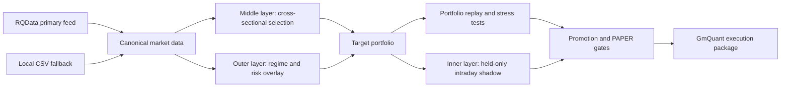

# HelkiQuant

[](https://www.python.org/)
[](LICENSE)

HelkiQuant is a production-oriented A-share quantitative research and execution
system. It combines cross-sectional stock selection, regime-aware portfolio
risk control, held-position intraday overlays, purged walk-forward validation,
portfolio-level replay, and GmQuant deployment tooling.

The repository contains project-owned strategy, validation, and execution code.
It does not vendor Microsoft Qlib, market datasets, trained models, account
snapshots, credentials, or generated trading artifacts.

## Architecture



### Strategy Layers

- **Middle layer:** the primary alpha engine. It ranks the eligible A-share
  universe, applies Top-K selection, a rebalance buffer, industry concentration
  control, liquidity checks, and ST/delisting exclusions.
- **Outer layer:** a risk overlay. It maps adverse market regimes to portfolio
  exposure and remains disabled whenever strict OOF evidence does not improve
  risk-adjusted behavior.
- **Inner layer:** a held-position-only intraday overlay. It uses decision-time
  features and fixed sell/buyback windows. It is deliberately shadow-only until
  portfolio replay and PAPER gates pass.

## Research Discipline

- Purged walk-forward folds with embargoed validation windows.
- Out-of-fold predictions as the only input to portfolio optimization.
- Factor selection and model comparison separated from untouched evaluation.
- Capital, commission, slippage, turnover, cash, sell-block, and stale-holding
  stress scenarios.
- Frozen Profile promotion with artifact hashes and fail-closed gates.
- One PAPER activation record per account, strategy, and trade date.

## Data Policy

RQData is the primary source for daily bars, 1-minute bars, trading calendars,
and PIT ST/suspension state. Audited local daily CSV files can fill missing
historical dates or symbols, with the API row winning on equal timestamps.
Minute histories must remain source-consistent across corporate actions; use a
primary-only minute build whenever adjustment scales differ between providers.

The source-quality gate compares normalized OHLC paths, returns, timestamp
coverage, volume and turnover consistency, duplicate rows, and invalid bars
before a canonical provider can be promoted.

No market data is committed to this repository. Configure the SDK license in a
Git-ignored local file:

```text
.secrets/rqdata_license.txt
```

Then run:

```powershell
python -m helki_quant.research.sync_rqdata_market_data doctor
python -m helki_quant.research.sync_rqdata_market_data daily `
  --start-date 2025-01-01 --end-date 2026-06-05 `
  --symbols sz000001,sh600000
python -m helki_quant.research.audit_rqdata_data_quality `
  --start-date 2025-01-01 --end-date 2026-06-05 `
  --symbols sz000001,sh600000 --sample-size 0
python -m helki_quant.research.materialize_rqdata_canonical minute `
  --start-date 2025-01-01 --end-date 2026-06-05 `
  --symbols sz000001,sh600000 --primary-only
```

## Installation

```powershell
python -m venv .venv
.venv\Scripts\Activate.ps1
python -m pip install --upgrade pip
pip install -e ".[research,dev]"
pytest
```

RQSDK is installed into a separate local runtime because its pinned scientific
stack may conflict with the main research environment:

```powershell
powershell -ExecutionPolicy Bypass `
  -File src\helki_quant\research\install_rqsdk_isolated.ps1
```

## GmQuant Deployment

The deployment runtime is under `src/helki_quant/deployment/gmquant`. It reads
the token, simulation account, target file, forbidden-symbol file, and audit
directory from environment variables. No account or credential is embedded in
the repository.

Required runtime inputs include:

```text
GM_TOKEN
GM_ACCOUNT_ID
GM_C_TARGETS
GM_C_FORBIDDEN_SYMBOLS
```

The runtime validates target freshness, account binding, ST/suspension state,
position synchronization, target transition, and activation-registry integrity
before submitting PAPER orders.

Promotion to a PAPER candidate is fail-closed. The final gate requires a
complete 60-session canonical untouched window, a matching frozen-profile
promotion report, a clean target preflight, exact local-to-GmQuant execution
reconciliation, and at least 20 finalized PAPER sessions:

```powershell
helki-live-readiness `
  --config configs/live_readiness.example.json `
  --canonical-readiness outputs/canonical_readiness.json `
  --promotion outputs/promotion.json `
  --preflight outputs/preflight.json `
  --gm-compare outputs/gm_compare.json `
  --activation-registry outputs/paper_activation_registry.jsonl `
  --expected-account-id $env:GM_ACCOUNT_ID `
  --output outputs/live_readiness.json
```

The gate never authorizes real-money deployment. A passing result only marks
the frozen package as ready for a separate human-approved deployment review.

## Project Layout

```text
src/helki_quant/
  deployment/       GmQuant runtime and PAPER activation controls
  research/         factors, labels, OOF, replay, stress and promotion tools
  research/execution/
                    project-owned A-share T+1 ledger
  research/data_sources/
                    isolated RQData bridge and canonical source gateway
tests/              strategy, execution and safety regression coverage
configs/            portable example configuration
```

See [ARCHITECTURE.md](ARCHITECTURE.md) for component boundaries and
[SECURITY.md](SECURITY.md) for credential and deployment requirements.

## Status

The outer-plus-middle portfolio is implemented as a GmQuant PAPER candidate.
The intraday layer remains no-order/shadow-only pending its separate strict
gate. Backtests, OOF reports, and passing tests are implementation evidence,
not a guarantee of future returns or authorization for real-money trading.

## License

Original project code is released under the [MIT License](LICENSE). Optional
third-party dependencies and derived components retain their own licenses; see
[THIRD_PARTY_NOTICES.md](THIRD_PARTY_NOTICES.md).
